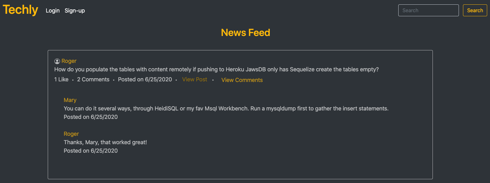

# Techly

## Description 
This project is a CMS-style social networking site where developers can publish posts and comment on other developers post. This application follows the MVC paradigm in it's structure and uses Handlebars.js as the templating language, Sequelize as the ORM, and the express-session npm package for authentication. 

## Table of Contents
* [Installation](#installation)
* [Usage](#usage)
* [License](#license)
* [Contributing](#contributing)
* [Tests](#tests)
* [Questions](#questions)

## Installation 
- The user may clone this repository from GitHub. This application requires Node.js, Express.js, Sequelize, mysql2, connection-session/express-session, and Jest. 
- If cloning the repo, run `npm i` to run all modules. 
- To connect to the database run `mysql -u root -p` and enter password, the same you'll add to your .env file. A sample .env_sample includes the info you will need in your .env file (but remove the `_sample` from the filename).
- Then run `source schema.sql` to create the database.
- To connect to the Express server run `npm start` from the bash terminal.
- After running `npm start` the tables will be created with no rows. To add the rows, you may run the INSERT statements through the mysql command line, located in the mysql dump db/techly_db3.sql

## Usage 
This application will allow users to sign up if they are not a member, then once they are logged in they are able to view their user profiles, other users profiles, add new posts, and comment on/like other developers post. Users will also be able to search for keywords and return posts that contains that keyword.  
Please view the site hosted on the Heroku platform - [Techly](https://techly.herokuapp.com/). 

Attached is a walkthrough of the application
https://drive.google.com/file/d/1Dnp2MLb1cqJ0OAgde9IxXSN6WUymz0hU/view

## License 
This project is license under MIT

## Contributing 
Contributors of this project include Nicole Wallace, David Stahl, and Asa Thisner. 

## Tests
The tests in this application verifies data formatting using Jest.  

## Questions
If you have any questions about this project, please contact me directly at nicole.elisaw@gmail.com. You can view more of my projects at https://github.com/nicolewallace09.